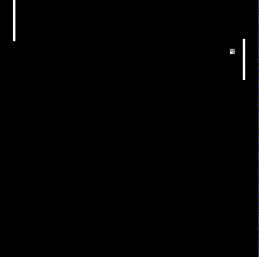

# Agent Cooperation in DRL (Pong)
This is a python (tensorflow) implementation of the following paper in python: https://arxiv.org/pdf/1511.08779.pdf
The goal is to retain the ball on the table as long as possible.
I have implemented it by writing a custom pong environment because the Atari one seems to be available only for Lua.

This is a collection of samples taken at lengthly intervals, training on my CPU: 

 
There are two different networks (which consist of Convolutional, Dense and GRU layers) controlling the two paddles. They are made to cooperate by giving a negative reward to both when one of them leaves the ball. When we give different rewards, for instance x for the winning one and -1 for the losing one, by changing x from -1 to 1, we transition the system from coordination to competition (as given in the paper). In order to experiment with such rewards, simply change the rewards given in the Pong class.

## Running the script and opening Tensorboard
Simply run train.py  
The above code **automatically configures Tensorboard**. Tensorboard has been configured to bind with port 8010. If yours isnt free, change it in config.py. The console will print out a URL (local), simply open up that in your browser to check the progress. Tensorboard will show only one plot: the average number of hits over the last 30 episodes.
